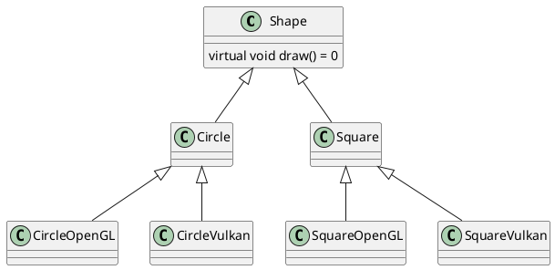
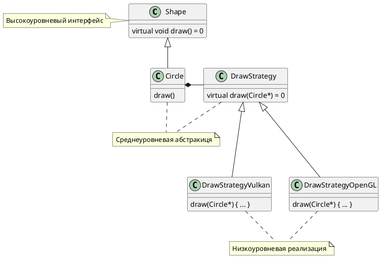
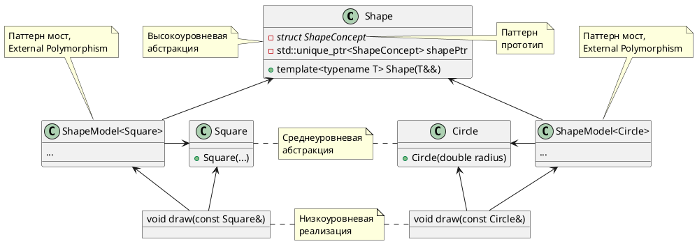

# Нестандартный полиморфизм. Паттерн Type Erasure.

Автор:
Куприн Андрей

# Оглавление

<!-- TOC -->
* [Введение и постановка задачи](#введение-и-постановка-задачи)
* [Наследование](#наследование)
* [Паттерны](#паттерны)
* [Двигаемся к Type Erasure](#двигаемся-к-type-erasure)
  * [Паттерн External Polymorphism](#паттерн-external-polymorphism)
* [Type Erasure](#type-erasure)
* [Полный код](#полный-код)
* [Источники](#источники)
<!-- TOC -->

# Введение и постановка задачи

Мы пройдем по следующим шагам:
- Посмотрим на проблему.
- Решим ее обычным полиморфизмом.
- Пройдем небольшими шагами к более элегантному решению
    - Strategy
    - External Polymorphism
    - Type Erasure

Философия.

Изменения - основная проблема создания программного обеспечения. Большая задача в разработке ПО - сделать его таким,
чтобы его можно было легко изменять. И одной из основных проблем в изменении существующего кода - его зависимости.
Привязанность кода к внешним зависимостям очень сильно "сковывает" движения программиста при внесении чего-то нового в
код.

Посмотрим на задачу: хотим рисовать разные фигуры.

Задача искусственная, но очень хорошо иллюстрирующая всё, что я собираюсь показать.

Но не заостряйте свое внимание именно на фигурах, все-таки паттерн, про который я собираюсь рассказать, применим еще много к чему.

<p style="page-break-after: always;"> </p>

# Наследование

Мы хотим рисовать разные фигуры. Сперва создадим базовый абстрактный класс `Shape` с методом его рисования на экран

```cpp
struct Shape {
    virtual void draw() = 0;
};
```

Теперь определим парочку конкретных фигур, например квадрат и круг унаследовав их классы `Square` и `Circle` от `Shape`.
Также в них определим виртуальный метод `draw`.

```cpp
struct Circle : public Shape {
    void draw() override {
        std::cout << "I am Circle" << std::endl;
    }
};

struct Square : public Shape {
    void draw() override {
        std::cout << "I am Square" << std::endl;
    }
};
```

Типов фигур может быть очень много, каждый из классов фигур обязан давать определение методу `draw`. Но такой подход
может очень быстро привести нас к проблемам.

Рассмотрим конкретный класс `Circle` - в нашей текущей реализации он сильно связан с деталями реализации механизма
рисования фигур на экран, а это плохо.

Например, реализация рисования фигур может быть зашита где-то глубоко в используемой библиотеке или написана в другом
месте проекта.

К тому же такой подход позволяет иметь только одну реализацию рисования фигур. Допустим, мы пишем приложение, используя
OpenGL для рисования разной информации на экран, но вдруг нам понадобилось портировать весь рисующий функционал ещё и на
Vulkan/Metal/DirectX. Что делать в таком случае? К решению этой проблемы можно подойти с разных сторон.

<p style="page-break-after: always;"> </p>


```cpp
struct Shape {
    virtual void drawOpenGL() = 0;
    virtual void drawVulkan() = 0;
    // и так далее
};
```

Тогда при использовании данного класса нам нужно будет делать выбор, какой из методов использовать:

```cpp
void drawAll(std::vector<Shape*> v){
    for(auto *shape: v){
        switch (API::getGraphicsApi()) {
            case OpenGL:
                shape->drawOpenGL();
                break;
            case Vulkan:
                shape->drawVulkan();
                break;
            default:
                throw std::runtime_error("unsupported graphics api");
        }
    }
}
```

Второй подход - создать новые классы для каждого из графических движков.

```cpp
struct CircleOpenGL : public Circle {
    void draw() override {
        std::cout << "I am Circle (OpenGL)" << std::endl;
    }
};
struct CircleVulkan : public Circle {
    void draw() override {
        std::cout << "I am Circle (Vulkan)" << std::endl;
    }
};
```

<p style="page-break-after: always;"> </p>

Тогда при создании новых объектов фигур нужно будет откуда-то узнавать, поддержка какого графического движка есть на
текущей машине и создавать объект соотвествующего класса:

```cpp
Shape* createCircle(){
    switch (API::getGraphicsApi()) {
        case OpenGL:
            return new CircleOpenGL;
            break;
        case Vulkan:
            return new CircleVulkan;
            break;
        default:
            throw std::runtime_error("unsupported graphics api");
    }
}
```

И аналогично для `Square`. Да, оба подхода сработают. Для маленьких проектов, возможно, даже ничего страшного не
произойдёт.

Но проекты развиваются. Представим, что через какое-то время нам потребовалось сохранять существующие в программе фигуры
в постоянную память. Требуется создать новый метод `serialize`. Добавляем его в базовый класс:

```cpp
struct Shape {
    virtual void draw() = 0;
    virtual void serialize() = 0;
};
```

И вдруг понимаем, что делать сериализацю объектов можно в множество разных форматов (JSON, toml, XML, ...). И опять та
же история, что и с разными графическими движками. Я уже не буду описывать, что иметь в своей программе подобные
классы - плохо:

```cpp
struct CircleOpenGL_JSON : public Circle {/* */};
struct CircleOpenGL_XML : public Circle {/* */};
struct CircleVulkan_JSON : public Circle {/* */};
struct CircleVulkan_XML : public Circle {/* */};
```

Стоит отметить, что добавление нового метода в базовый класс привело нас также к дублированию кода. Метод `draw` будет одинаковым у
классов `CircleOpenGL_JSON` и `CircleOpenGL_XML`, а метод `serialize` будет одинаковым у классов `CircleOpenGL_JSON`
и `CircleVulkan_JSON`.

Иерахия классов становится всё глубже и запутаннее. А если нам понадобится ещё один метод в базовом классе?

<!--


Теперь мы можем определить несколько разных методов рисования фигур, унаследовавшись от `DrawStrategy`:

```cpp
class DrawStrategyOpenGL : public DrawStrategy{
    void draw(Circle* circle) override {
        // do OpenGL stuff
    }
    void draw(Square* square) override {
        // do OpenGL stuff
    }
};
class DrawStrategyVulkan : public DrawStrategy{
    /* аналогично */
};
```

<p style="page-break-after: always;"> </p>

А в классе `Circle` теперь добавим поле, хранящее метод его рисования.

```cpp
struct Circle : public Shape {
    std::unique_ptr<DrawStrategy> drawStrategy;
    explicit Circle(DrawStrategy *drawStrategy) 
        : drawStrategy(drawStrategy) {
        
    }
    void draw() override {
        drawStrategy->draw(this);
    }
};
```

Применение:

```cpp
int main(){
    std::vector<std::unique_ptr<Shape>> v;
    v.emplace_back(
            std::make_unique<Circle>(std::make_unique<DrawStrategyOpenGL>())
    );
    v.emplace_back(
            std::make_unique<Circle>(std::make_unique<DrawStrategyVulkan>())
    );
    for(auto &sh: v){
        sh->draw();
    }
}
```

Таким образом мы выделили в отдельный класс метод рисования. В общем случае - тот метод, который может в разных
обстоятельствах меняться.

Теперь, если потребуется добавить поддержку нового графического движка. то нужно будет всего лишь добавить новый класс,
унаследованный от `DrawStrategy`. Не придется менять уже существующий код.

<!--


Стратегии в стандартной библиотеке шаблонов:

```cpp
template<
    typename _Tp,
    typename _Alloc = std::allocator<_Tp>>  // <-- СТРАТЕГИЯ. 
                //Аллокатор определяет, как будет выделяться память
    class vector {/* ... */};

template<
    typename _Value,
    typename _Hash = hash<_Value>,       // <-- СТРАТЕГИЯ Хеш функция
    typename _Pred = equal_to<_Value>,   // <-- СТРАТЕГИЯ Как сравнивать ключи
    typename _Alloc = allocator<_Value>> // <-- СТРАТЕГИЯ (см. выше)
    class unordered_set {/* ... */};

template <
    typename _Tp, 
    typename _Dp = default_delete<_Tp>> // <-- СТРАТЕГИЯ Как освобождать память
    class unique_ptr
```

Итоги применения паттерна стратегия:

- Вынесение деталей реализации в отдельные классы. (Принцип единственной ответственности/Single responsibility
  principle)
- Создали возможность легкого расширения (Принцип открытости/закрытости. OCP)
- Разделили интерфейсы (Interface segregation principle)
- Избавились от дублирования кода (DRY)
- Избавились от глубины иерархии
- Упростили сопровождение кода. Легче понимать, легче писать

Но! Минусы:

- Производительность с точки зрения вызовов. При вызове `draw` происходит на самом деле два
  вызова: `main` -> `Circle::draw` -> `DrawStrategy::draw(Circle*)`
- Производительность с точки зрения памяти. Множество маленьких выделений памяти для стратегий.
- Производительность с точки зрения указателей. Много указателей, мы переходим по их адресам.
- Нужно создавать отдельные абстрактные классы-стратегии для другой функциональности, например `SerializeStrategy` для
  сериализации.
- Если отказаться от умных указателей в пользу производительности, то придётся вручную управлять временем жизни
  объектов. См. [Интересная лекция про цену абстракций](https://youtu.be/rHIkrotSwcc).
- `Circle` и `Square` всё еще знают про то, что их нужно как-то рисовать. Они всё еще несут некоторую ответственность за
  эти операции. Что-то в этом чувствуется не так. Операция рисования, конечно, зависит от фигуры, которая рисуется в
  данный момент. Но по идее самой фигуре не должно быть дела, рисуют ли её или делают что-то другое. Это слегка размывает абстракцию фигуры.

Существует решение лучше!

# Двигаемся к Type Erasure

Вы уже могли слышать что-то про стирание типа, поэтому уточню:

- Это НЕ про
    - это не про `void*`
    - это не про указатели на базовый класс
    - это не про `std::variant`. `std::variant` основан на фиксированном наборе типов и предоставляет открытый набор
      операций над ними. Мы же пытаемся достигнуть обратного - открытого для расширения набора типов и фиксированного
      набора операций над ними.
- Это про
    - Шаблонный конструктор
    - Интерфейс без единого слова `virtual`
    - Смесь паттернов External Poymorphism, Bridge, Prototype

Посмотрим на класс `Circle`, ещё не испорченный разными не относящимися к фигурам методами, а также наследованием:

```cpp
class Circle {
public:
    explicit Circle(double r)
            : radius(r) {}

    double getRadius() const {
        return radius;
    }

    void setRadius(double r) {
        radius = r;
    }

private:
    double radius;
    // тут могут быть еще полезные данные
    // координаты центра например
};
```

И аналогично может быть определён класс `Square`.

- Этим классам не нужен базовый класс
- Им не нужно знать друг о друге
- Они не должны забатиться о том, что с ними можно сделать

Это очень удобно. Такими классами максимально просто пользоваться. У них нет никаких зависимостей. И главное - мы их больше никогда не изменим!

Теперь перейдем к решению проблемы их рисования.

## Паттерн External Polymorphism

Описание задачи этого паттерна из исходного документа, описывающего его:

_Allow classes that are not related by inheritance and/or have
no virtual methods to be treated polymorphically._

И мой вольный перевод:

_Дать возможность классам, не связанным наследованием и/или не имеющим виртуальных методов, быть обработанными так, как
будто они полиморфные._

Посмотрим на данный код и разберем, что к чему

```cpp
struct ShapeConcept {
    virtual ~ShapeConcept() = default;
};

template<typename T>
struct ShapeModel : public ShapeConcept {
    T object;

    explicit ShapeModel(T &&shape) : object(std::move(shape)) {}

    explicit ShapeModel(const T &shape) : object(shape) {}
};
```

Чуть позже станет ясно, почему здесь написано `struct`, а не `class`.
Конструктор `ShapeModel` принимает объект любого класса и сохраняет его в своё поле. Этим классом может быть `Circle`
или `Square`, или любая другая фигура, которую мы создадим.

В то же время `ShapeModel` наследуется от `ShapeConcept`, чуть позже станет ясно, почему.

Теперь в `ShapeConcept` добавим все функции-операции над фигурами, которые могут быть нужны нам (оставлю в будущем
только `draw` для краткости).

```cpp
struct ShapeConcept {
    virtual ~ShapeConcept() = default;
    virtual void draw() const = 0;
    // ...
};
```

<p style="page-break-after: always;"> </p>

И особенным образом дадим определение этим функциям в производном классе `ShapeModel`:

```cpp
template<typename T>
struct ShapeModel : public ShapeConcept {
    T object;
    explicit ShapeModel(T &&shape) : object(std::move(shape)) {}
    explicit ShapeModel(const T &shape) : object(shape) {}
    void draw() const override {
        draw(object); // Что за функция draw? См. после кода.
    }
};
```

Что же за вызов функции `draw(object)`? Когда мы пишем такое, мы утверждаем, что где-то вне классов, только что
созданных нами, существует функция `draw`, которая в качестве аргумента сможет принять `object` типа `T`. Например: `void draw(const Circle &c) { ... }`

Это уже наложило ограничения на то, какие типы могут быть подставлены вместо `T` во время инстанциации шаблона `ShapeModel`. А именно: для этих типов обязательно должна существовать функция `draw`, принимающая их в качествеаргумента.

`ShapeModel` наследуется от `ShapeConcept`. Таким образом, с помощью задания чисто виртуальных функций в
классе `ShapeConcept` мы говорим, какие функции-обработчики должны обязательно существовать для объектов, которые мы
будем в будущем хранить внутри `ShapeModel`.

В этом и заключается паттерн External Polymorphism.

- Мы извлекли полиморфную часть классов иерархии(которая теперь уже и не нужна) в отдельное место
- Мы всё еще можем строго задавать функции-обработчики наших классов
- Всё еще могут существовать абстрактные классы (для которых нет полного набора функций-обработчиков)

```plantuml
@startuml EP
class Common{
    request()
}
class "CommonAdapter<Concrete>"{
    request()
}
class "AccessPoint<Concrete>"{
    request()
}
class Concrete{
    specific_request()
}
Client - Common
Common -- "CommonAdapter<Concrete>"
"CommonAdapter<Concrete>" - "AccessPoint<Concrete>"
"AccessPoint<Concrete>" -- Concrete
@enduml
``` -->


![](EP.png)

В итоге данный паттерн:

- Позволяет обрабатывать **_любой_** объект так, как будто он полиморфный. Можно даже создать видимость полиморфизма для
  фундаментальных типов (например `int`)
- Позволяет вынести детали реализации из класса
- Позволяет классам не заботиться (и даже знать) о тех операциях, которые над ними совершаются
- Открывает возможность лёгкого расширения функциональности

Покажу пример работы:

```cpp
class Circle { /* см. выше */ };
struct ShapeConcept { /* см. выше */ };

template<typename T>
struct ShapeModel : public ShapeConcept { /* см. выше */ };

// Определим функцию, которая умеет рисовать круг
void draw(const Circle &s) {
  std::cout << "I am Circle with radius = " << 
        s.getRadius() << std::endl;
}
// Теперь класс Circle отвечает требованиям ShapeConcept
int main(){
    std::vector<std::unique_ptr<ShapeConcept>> v;
    v.emplace_back(std::make_unique<ShapeModel<Circle>>{3.0});
    v.emplace_back(std::make_unique<ShapeModel<Circle>>{4.0});
    v.emplace_back(std::make_unique<ShapeModel<Circle>>{5.0});
    for(auto *shape: v){
        shape->draw();
    }
  
  // int не отвечает требованиям ShapeConcept
  // следующий код не скомпилируется
  // ошибка при инстанциации класса ShapeModel<int>
  // так как нет функци draw(int)
  ShapeModel test(123); 
}
```

<!--


Из оригинального документа, описывающего данный паттерн есть ещё один пример. Допустим, мы работаем с несколькими
библиотеками и хотим написать сериализацию для объектов из этих библиотек. Взять и создать для них общий базовый класс
не представляется возможным. С помощью данного паттерна мы можем решить эту проблему.

Создаем класс `SerializableConcept`, который описывает, какие внешние функции должны существовать (`serialize` в данном
случае). От этого класса наследуем класс `SerializableModel` (аналогично `ShapeModel`). И получаем возможность
создать `SerializableModel` над любым классом, для которого существует функция `serialize`, принимающая этот класс как
аргумент. И, соответственно, теперь мы можем сериализовать любой класс.

И... Ура! Это работает! Но.

Подведём итоги применения паттерна External Polymorphism:

- Много указателей
- Много `std::make_unique`
- И много других вещей, которые мы не хотим делать вручную

Давайте улучшим этот паттерн, чтобы избавиться от данных проблем.

# Type Erasure

Возьмём и обернем `ShapeConcept` и `ShapeModel` в класс `Shape`, в его секцию `private` (становится понятно, зачем было
объявлять их `struct` - теперь они всё равно спрятаны).

```cpp
class Shape {
private:
    struct ShapeConcept { /* см. выше */ };

    template<typename T>
    struct ShapeModel : public ShapeConcept { /* см. выше */ };
};
```

Таким образом мы прячем эти относительно искусственные два класса с не очень говорящими именами внутрь уже довольно
очевидной оболочки.

Теперь предоставим пользователю возможность создать любую фигуру. Добавим в класс `Shape` поле, хранящее конкретную
фигуру и шаблонный конструктор:

```cpp
class Shape {
private:
    struct ShapeConcept { /* см. выше */ };

    template<typename T>
    struct ShapeModel : public ShapeConcept { /* см. выше */ };
    
    std::unique_ptr<ShapeConcept> shapePtr; // новое поле
public:
    template<typename T>
    explicit Shape(T &&shape) 
        : shapePtr(new ShapeModel<T>(std::forward(shape))) {}
};
```

А теперь присмотритесь. Что делает этот новый конструктор? Он создает для переданного объекта соответсвующую
ему `ShapeModel`. Заметьте, новое поле имеет тип `std::unique_ptr<ShapeConcept>` и конструктор сохраняет в него
указатель на ShapeModel. А теперь посмотрим на то, что происходит с типами во время всех этих действий:

1. Объект передан в конструктор `Shape` - тип известен (`T`)
2. Создан объект класса `ShapeModel<T>` - тип исходного объекта всё еще здесь
3. Указатель на `ShapeModel<T>` сохранен внутри указателя на `ShapeConcept`. Так можно сделать, ведь они связаны
   наследованием. Но! Указатель на `ShapeConcept` уже не содержит в себе типа, который лежит внутри него. На этом шаге и
   произошло "стирание типа". Отсюда и название данного паттерна.

Но несмотря на то, что тип кажется утерянным, мы всё еще можем пользоваться объектом, который только что сохранили. Всё,
что нужно для его обработки уже написано в классах `ShapeConcept` и `ShapeModel`. Нужна лишь внешняя функция-обработчик.

Этот шаг с созданием шаблонного конструктора `Shape` и есть проявляение паттерна Bridge.

Для справки (wikipedia):

- Мост - структурный шаблон проектирования, используемый в проектировании программного обеспечения чтобы «разделять
  абстракцию и реализацию так, чтобы они могли изменяться независимо»

Теперь мы можем создать сколько нам угодно классов для разных фигур, создать перегрузки функции `draw`, способные
принимать объекты их типов в качестве аргументов. А красота в том, что компилятор инстанциирует нужные шаблоны и
предоставит нам возможность пользоваться ими, как полиморфными! Нам самим не нужно писать этот код.

И последнее, что нужно для пользования классом `Shape`. Все еще нет возможности нарисовать сохраненную фигуру. Для
решения этой проблемы создадим функцию:

```cpp
class Shape {
private:
    /* см. выше */
public:
    /* конструктор */
    
    friend void draw(const Shape &shape) {
        shape.shapePtr->draw();
        // shape                    -  Тип Shape
        // shape.ShapePtr           -  Тип ShapeConcept
        // shape.ShapePtr->draw()   -> Вызов ShapeModel::draw()
        // Внутри реализации
        // Вызов ShapeModel::draw() -> Вызов draw(T)
    }
};
```

Новая функция должна быть объявлена с словом `friend`, чтобы она могла внутри себя обратиться к полю `shapePtr`
класса `Shape`.

<p style="page-break-after: always;"> </p>

Пример применения:

```cpp
int main(){
    Shape circle(Circle{3.14});
    draw(circle); // красиво!
}
```

Теперь этим можно пользоваться, рисовать разные фигуры. Но, скорее всего, в мы столкнемся с проблемой. Как
копировать объекты класса `Shape`? Ведь этот класс не знает тип объекта, который он хранит внутри себя.

С решением этой проблемы поможет паттерн Прототип.

Суть паттерна (wikipedia). Прототип — это порождающий паттерн проектирования, который позволяет копировать объекты, не вдаваясь в
подробности их реализации.

Просто добавим новый чисто виртуальный метод `clone` в `ShapeConcept`:

```cpp
struct ShapeConcept {
    virtual ~ShapeConcept() = default;
    virtual std::unique_ptr<ShapeConcept> clone() const = 0;
    virtual void draw() const = 0;
    // ...
};
```

Теперь этот новый метод отвечает за копирование (клонирование) объектов.

Дадим этому методу определение в `ShapeModel`:

```cpp
template<typename T>
struct ShapeModel : public ShapeConcept {
    /* всё остальное */

    std::unique_ptr<ShapeConcept> clone() const override {
        return std::make_unique<ShapeModel>(*this);
    }
};
```

<p style="page-break-after: always;"> </p>

Конечно же, дадим пользователю возможность использовать этот метод, добавим соотвествующую функцию в `Shape`:

```cpp
class Shape {
private:
    /* см. выше */
    std::unique_ptr<ShapeConcept> shapePtr;
public:
    /* всё остальное */
    
    Shape(const Shape& other) 
        : shapePtr(other.shapePtr->clone();) {}
};
```

Теперь можно написать так:

```cpp
int main(){
    Shape circle(Circle{3.14});
    auto circle_copy = circle;
    draw(circle_copy);
}
```

Анализ данного решения:

1. `Shape` - высокоуровневая абстракция "контейнера" для фигур, который позволяет хранить в себе только те фигуры,
   которые соответствуют требованиям ShapeConcept.
2. `Circle`, `Square` и др. - содержат только нужную информацию. Не знают о классе `Shape`. Не знают об операциях над
   ними. Не связаны полиморфизмом. Среднеуровневая абстракция.
3. Функции `draw`, `serialize` и др. Делают некие операции над нужными фигурами - низкоуровневая абстракция.
4. Класс `ShapeModel` - хранит в себе конкретную фигуру, связывает `Shape` с конкретными функциями-обработчиками фигур (Мост).
   Сгенерирован компилятором.

Что мы получили:

- Извлекли детали реализации
- Предоставили возможность лёгкого расширения функциональности
- Разделение интерфейсов
- Отсутствие дублирования кода
- Классы, с которыми мы работаем, больше не отвечают за операции, которые производятся над ними. Они не обязаны знать о
  них.
- Нет больших иерархий наследования.
- Нет указателей (для пользователя)
- Нет ручного управления памятью (для пользователя)
- Улучшили производительность
- И это всё в `private` секции нового класса `Shape`!

В итоге. Что такое Type Erasure?

- Шаблонный конструктор
- Полностью НЕвиртуальный интерфейс (спасибо, External Polymorphism)
- External Polymorphism + Bridge + Prototype
- Очень элегантный современный паттерн :)

Что Type Erasure позволяет сделать?

- Избавиться от зависимостей
- Избавиться от указателей
- Улучшить производительность
- Улучшить читабельность и "понимательность" кода
- Упростить сопровождение кода

<!--


<p style="page-break-after: always;"> </p>

```cpp
class Circle {
public:
    explicit Circle(double r)
            : radius(r) {}

    double getRadius() const {
        return radius;
    }

    void setRadius(double r) {
        radius = r;
    }

private:
    double radius;
};

void draw(const Circle &s) {
    std::cout << "I am Circle with radius = " <<
              s.getRadius() << std::endl;
}

struct Square {
};

void draw(const Square &s) {
    std::cout << "I am Square" << std::endl;
}

int main() {
    Shape circle(Circle{3.14});
    Shape square(Square{});
    // Shape not_supported(123); // не скомпилируется
    draw(circle);
    draw(square);

    std::vector<Shape> v;
    for (int i = 0; i < 5; ++i) {
        if (rand() % 2 == 0)
            v.emplace_back(circle); // конструктор копирования!
        else
            v.emplace_back(square);
    }
    for (const auto &shape: v) {
        draw(shape);
    }
    return 0;
}
```

<p style="page-break-after: always;"> </p>

# Источники

1. [Breaking Dependencies: Type Erasure - A Design Analysis - Klaus Iglberger - CppCon 2021](https://youtu.be/4eeESJQk-mw)
2. [External Polymorphism. An Object Structural Pattern for Transparently Extending C++ Concrete Data Types. Chris Cleeland and Douglas C. Schmidt](https://www.dre.vanderbilt.edu/~schmidt/PDF/C++-EP.pdf)
3. [Abstraction Can Make Your Code Worse](https://youtu.be/rQlMtztiAoA) - про coupling (связность).
4. [CppCon 2017: Nicolai Josuttis “The Nightmare of Move Semantics for Trivial Classes”](https://youtu.be/PNRju6_yn3o). (
   См. конструктор `Shape`)
5. [CppCon 2019: Chandler Carruth “There Are No Zero-cost Abstractions”](https://youtu.be/rHIkrotSwcc) - про производительность умных указателей, да и в целом про производительность разных абстракций.
6. [Back to Basics: Type Erasure - Arthur O'Dwyer - CppCon 2019](https://youtu.be/tbUCHifyT24)
7. [CppCon 2014: Zach Laine "Pragmatic Type Erasure: Solving OOP Problems w/ Elegant Design Pattern"](https://youtu.be/0I0FD3N5cgM)
8. [Jason Turner. C++ Weekly - Ep 343 - Digging Into Type Erasure](https://youtu.be/iMzEUdacznQ)
9. [Блог Andrzej Krzemieński. Type erasure — Part I](https://akrzemi1.wordpress.com/2013/11/18/type-erasure-part-i/)
10. [Блог Andrzej Krzemieński. Type erasure — Part II](https://akrzemi1.wordpress.com/2013/12/06/type-erasure-part-ii/)
11. [Блог Andrzej Krzemieński. Type erasure — Part III](https://akrzemi1.wordpress.com/2013/12/11/type-erasure-part-iii/)
12. [Блог Andrzej Krzemieński. Type erasure — Part IV](https://akrzemi1.wordpress.com/2014/01/13/type-erasure-part-iv/)
13. [C++ type erasure. cplusplus.com](https://cplusplus.com/articles/oz18T05o/)
14. Design Patterns: Elements of Reusable Object-Oriented Software / Erich Gamma, Richard Helm, Ralph Johnson, John Vlissides. - United States : Addison-Wesley, 1994. - 395 c. - ISBN 0-201-63361-2.
15. Alexander Shvets. Dive Into Design Patterns. - электронная книга : Refactoring.Guru, 2018. - 406 c.
